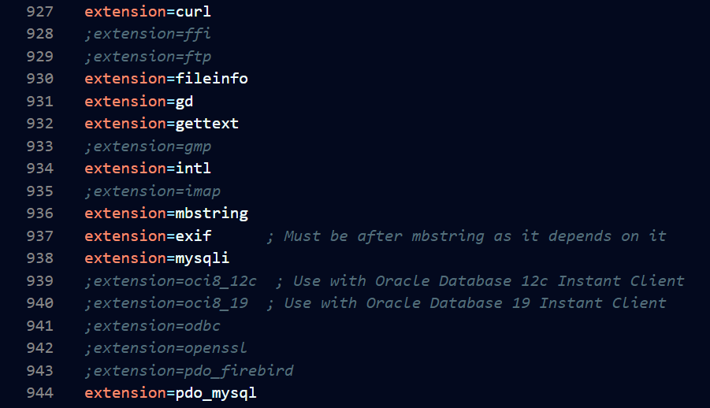
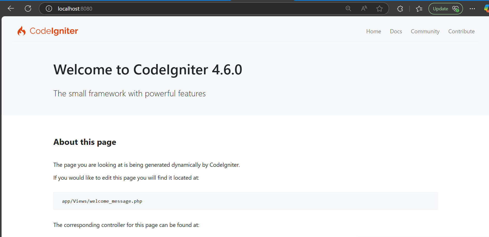
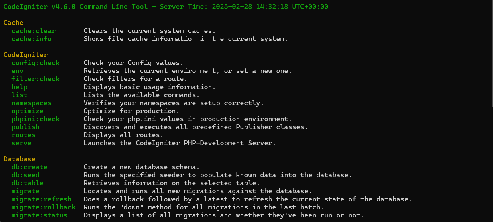
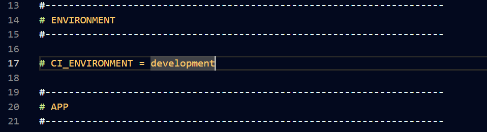
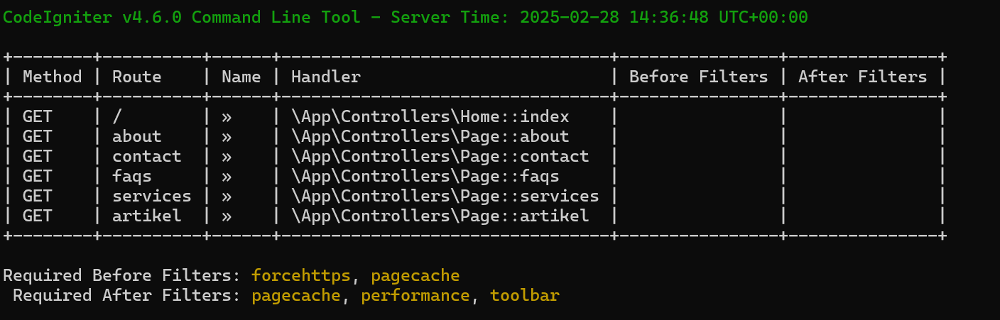
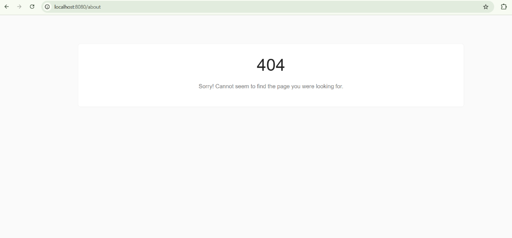
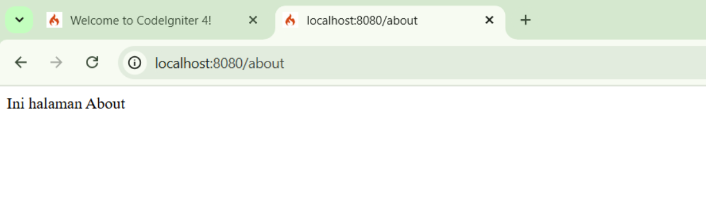
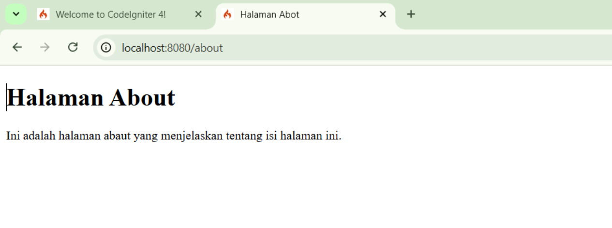
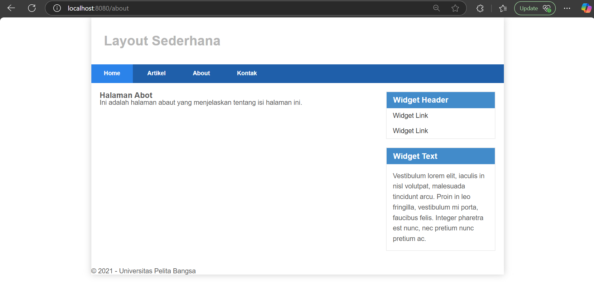

<div align="center">
  
  
</div>

# 📌 Laporan Praktikum 1: PHP Framework (CodeIgniter 4)

## 👤 Profil Mahasiswa

| Atribut         | Keterangan            |
| --------------- | --------------------- |
| **Nama**        | Daffa Sadewa Putra    |
| **NIM**         | 312310463           |
| **Kelas**       | TI.23.A.5             |
| **Mata Kuliah** | Pemrograman Website 2 |

---

## 🎯 Tujuan Praktikum

Dalam praktikum ini, tujuan utama yang ingin dicapai adalah sebagai berikut:

- Memahami konsep dasar dari penggunaan Framework dalam pengembangan aplikasi web.
- Memahami konsep Model-View-Controller (MVC) yang menjadi dasar dalam framework CodeIgniter 4.
- Mempelajari cara menginstal dan mengonfigurasi CodeIgniter 4 pada server lokal.
- Membuat program sederhana menggunakan CodeIgniter 4.
- Mengimplementasikan routing dan controller untuk mengatur akses ke berbagai halaman.
- Menggunakan View dan Layout untuk membuat tampilan yang lebih terstruktur dan dinamis.

---

## ⚙️ Langkah-Langkah Praktikum

### 📌 1. Persiapan Awal

Sebelum memulai pengembangan dengan CodeIgniter 4, beberapa persiapan harus dilakukan:

1. Mengaktifkan ekstensi PHP yang dibutuhkan melalui `php.ini`.
2. Melakukan restart Apache melalui XAMPP Control Panel agar perubahan diterapkan.
3. Memastikan bahwa Composer telah terinstal untuk mempermudah pengelolaan dependency CodeIgniter 4.

📷 **Screenshot Konfigurasi PHP.ini:**



---

### 📌 2. Instalasi CodeIgniter 4

Untuk memulai, kita perlu mengunduh dan menyiapkan CodeIgniter 4 pada server lokal:

1. Download CodeIgniter 4 dari [🔗 Situs Resmi CodeIgniter](https://codeigniter.com/download).
2. Ekstrak file yang telah diunduh ke dalam folder `htdocs/lab11_ci/`.
3. Ubah nama folder hasil ekstraksi menjadi `ci4` agar lebih mudah diakses.
4. Jalankan aplikasi dengan mengakses `http://localhost/lab11_ci/ci4/public/`.

📷 **Screenshot Tampilan Awal CodeIgniter 4:**



---

### 📌 3. Menjalankan Command Line Interface (CLI)

CodeIgniter memiliki CLI yang mempermudah pengembangan aplikasi. Untuk menjalankan CLI:

```bash
cd xampp/htdocs/lab11_ci/ci4/
php spark
```

📷 **Screenshot Hasil Perintah CLI:**



---

### 📌 4. Mengaktifkan Mode Debugging

Untuk mempermudah debugging, aktifkan mode development dengan mengubah file `.env`:

```bash
# Buka file .env dan ubah:
CI_ENVIRONMENT = development
```

📷 **Screenshot Konfigurasi Debugging:**



---

### 📌 5. Menambahkan Routing Baru

Routing digunakan untuk mengatur alamat URL yang akan diproses oleh aplikasi. Tambahkan kode berikut di `app/Config/Routes.php`:

```php
$routes->get('/about', 'Page::about');
$routes->get('/contact', 'Page::contact');
$routes->get('/faqs', 'Page::faqs');
```

Jalankan perintah berikut untuk melihat daftar routing yang telah dibuat:

```bash
php spark routes
```

📷 **Screenshot CLI & Error Page:**



---

### 📌 6. Membuat Controller Page

Buat file `Page.php` di `app/Controllers/` dengan isi sebagai berikut:

```php
<?php
namespace App\Controllers;
class Page extends BaseController {
    public function about() { echo "Ini halaman About"; }
    public function contact() { echo "Ini halaman Contact"; }
    public function faqs() { echo "Ini halaman FAQ"; }
}
```

📷 **Screenshot Tampilan About Page:**



---

### 📌 7. Membuat View untuk Halaman About

Buat file `app/Views/about.php` dengan kode berikut:

```php
<!DOCTYPE html>
<html>
<head>
    <title><?= $title; ?></title>
</head>
<body>
    <h1><?= $title; ?></h1>
    <p><?= $content; ?></p>
</body>
</html>
```

📷 **Screenshot Tampilan View About Page:**



---

### 📌 8. Menambahkan Layout Web dengan CSS

Untuk meningkatkan tampilan website, kita akan menggunakan template header dan footer:

1. Simpan file `style.css` di `public/`
2. Buat file `header.php` dan `footer.php` di `app/Views/template/`
3. Ubah `about.php` agar menggunakan `include`:

```php
<?= $this->include('template/header'); ?>
<h1><?= $title; ?></h1>
<p><?= $content; ?></p>
<?= $this->include('template/footer'); ?>
```

📷 **Screenshot Tampilan dengan Template:**



---

## ✅ Kesimpulan

Dari praktikum ini, kita telah memahami dasar-dasar penggunaan framework CodeIgniter 4. Beberapa hal yang telah kita pelajari antara lain:

- Instalasi dan konfigurasi awal CodeIgniter 4.
- Menjalankan CodeIgniter melalui CLI.
- Membuat dan mengelola routing untuk berbagai halaman dalam website.
- Membuat Controller dan View untuk menampilkan konten dinamis.
- Menerapkan layout dengan template header dan footer.
- Menggunakan CSS untuk mempercantik tampilan website.

Dengan menyelesaikan praktikum ini, kita mendapatkan pemahaman yang lebih baik tentang bagaimana CodeIgniter 4 mempermudah pengembangan aplikasi berbasis web dengan struktur yang lebih terorganisir dan efisien. 🚀🔥

